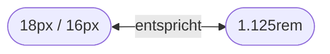

import Figure from '@components/Figure.astro'
import Table from '@components/Table.astro'
import Codepen from '@components/Codepen.astro'

import SnippetHeadlineBody from '@snippets/typografie/snippet-headline-body.astro'
import SnippetRelativeFontSize from '@snippets/typografie/snippet-relative-font-size.astro'
import SnippetLigatures from '@snippets/typografie/snippet-ligatures.astro'
import SnippetZeilenabstand from '@snippets/schriften/snippet-zeilenabstand.astro'
import SnippetContrast from '@snippets/schriften/snippet-contrast.astro'
import SnippetHurenkinder from '@snippets/schriften/snippet-hurenkinder.astro'

## Texte gestalten

Im [ersten Teil](/tutorials/grundlagen-der-mikrotypografie) der Serie „Typografie im Web“ haben wir einen Blick in die Historie der Typografie geworfen, den Begriff der Makrotypografie erörtert und gelernt, wie man Texte korrekt formatiert. Da die Grundlagen damit gelegt sind, können wir nun die Rakete zünden und uns um das typografische Layout kümmern.

> **Hinweis:** Falls du das Tutorial [Grundlagen der Mikrotypografie](/tutorials/grundlagen-der-mikrotypografie) noch nicht gelesen hast, empfehle ich dir, dies nachzuholen.

## Das Schriftbild

Die Gesamtheit der typografischen Gestaltung einer Website wird als Schriftbild bezeichnet. Es umfasst alle Aspekte, die das Erscheinungsbild und die Lesbarkeit von Texten beeinflussen. Dazu gehören Schriftart, Schriftschnitt, Schriftgröße, Laufweite, Zeichenabstand und Zeilenabstand.

Für ein herausragendes Design benötigst du nicht große farbige Flächen oder wilde Animationen. Feinjustierungen an der Typografie machen hier schon den Unterschied, insbesondere bei der Lesbarkeit der Texte. Das zahlt so auch direkt in die Usability[^1] mit ein.

### Schriftart und Schriftschnitt

Um nicht zu monoton zu wirken, verwenden manche Websites unterschiedliche Schriftarten für Fließtext und Überschriften. Dem Muster folgend könntest du für deine Website den Fließtext mit einer serifenlosen Schriftart (Sans Serif) wie [Open Sans](https://fontsource.org/fonts/source-sans-3) im Schriftschnitt „400“ und Überschriften mit einer serifenbetonten Schriftart wie [Merriweather](https://fontsource.org/fonts/merriweather) (Serif) im Schriftschnitt „500“ ausstatten.

Serifen sind kleine, zusätzliche Striche am Ende der Buchstabenlinien einer Schrift. Sie helfen, das Auge beim Lesen zu führen und können den Buchstaben ein traditionelles oder formelles Aussehen verleihen. Serifenlose Schriftarten hingegen wirken durch ihre klare Linienführung moderner und sind oft am Bildschirm leichter zu lesen.

Schriftschnitte sind Variationen einer Schriftfamilie, die das Erscheinungsbild der Zeichen beeinflussen, z.&#8239;B. fett (bold), kursiv (italic) oder mager (light). In CSS wird der Schriftschnitt mit `font-weight` und einer Zahl angegeben, z.&#8239;B. 400 für normal, 600 für fett oder 900 für extrafett. Diese Werte sind herstellerspezifisch und nicht genormt.

Lass uns einen Blick auf das folgende Beispiel werfen, um zu sehen, wie du die Schriftarten und Schriftschnitte in CSS definieren kannst und wie das Ergebnis aussieht.

<Figure caption="Durch die Deklaration der Open Sans am Body und der Vererbung erhalten alle weiteren Elemente dieselbe Schriftart.">
  ```css
  /* Fließtext */
  body {
    font-family: 'Open Sans', sans-serif;
    font-weight: 400;
  }

  /* Überschriften */
  :is(h1, h2, h3, h4) {
    font-family: 'Merriweather', serif;
    font-weight: 600;
  }

  /* Textauszeichnung */
  b, strong {
    font-weight: 600;
  }

  i, em {
    font-style: italic;
  }
  ```
  <SnippetHeadlineBody title="Das Ergebnis" />
</Figure>

> **Tipp:** Im Tutorial [So bindest du Schriftarten in deine Website ein](/tutorials/webfonts-schriften-einbinden) zeige ich dir Schritt für Schritt, wie du Webfonts einbinden kannst, um sie dann wie oben deklarieren zu können.

### Schriftgröße

Die vom Browser vorgegebene Größe für Fließtext beträgt `16px` (Pixel) beim Root-Element[^2] `html`, die vom User aber auch in den Einstellungen des Browsers geändert werden kann.

Wenn du die Schriftgröße in Pixeln angibst, wird sie nicht mehr an die vom User gewählte Schriftgröße angepasst, es schränkt also die Zugänglichkeit der Website ein. Das ist besonders problematisch für Menschen mit Sehbehinderungen, die auf eine größere Schriftgröße angewiesen sind.

Daher solltest du die Schriftgröße in relativen Einheiten wie `rem` (Root-Em) oder `em` angeben. `1rem` entspricht dabei der Schriftgröße des Root-Elements, also `16px`. Vergrößert der User die Schriftgröße in den Einstellungen des Browsers, wird deine gewählte Schriftgröße entsprechend proportional angepasst.

> **Tipp:** Im Tutorial [Absolute und relative Einheiten in CSS](/tutorials/absolute-und-relative-einheiten) erläutere ich dir die Unterschiede zwischen den Einheiten und wann du besser relative Einheiten nutzen solltest.

Wenn du die Lesbarkeit der Texte auf deiner Website insgesamt verbessern möchtest, kannst du die Schriftgröße auch auf `18px` erhöhen, was der relativen Einheit `1.125rem` entspricht. Nach der folgenden Formel kannst du den relativen Wert ermitteln:



Du teilst den Zielwert `18px` durch den Basiswert `16px`, um den relativen Wert in `rem` zu erhalten. Doch wie sieht das nun konkret in CSS aus? Lass uns einen Blick auf den Code werfen:

<Figure caption="Achte bitte auf die unterschiedliche Nutzung der Einheiten `rem` und `em`.">
```css
body {
  font-size: 1.125rem; /* entspricht 18px */
  line-height: 1.4;
}

h1 {
  font-size: 1.667em; /* entspricht 30px */
}
```
</Figure>

Den Fließtext der gesamten Seite deklarierst du mit `rem`, damit alle Texte die gleiche Basis haben. Bei den Überschriften kannst du `em` verwenden, um sie relativ zur Schriftgröße des Fließtextes zu skalieren. Das ist besonders praktisch, wenn du die Schriftgröße des Fließtextes änderst, da sich die Überschriften dann automatisch anpassen.

Für Tablets und Desktop-Bildschirme empfehle ich sogar `20px` oder gar `22px`, da hier der Abstand vom Auge zum Bildschirm größer ist als bei mobilen Geräten. Folgende Tabelle zeigt dir die empfohlenen Schriftgrößen für verschiedene Gerätekategorien:

<Table mode="responsive">
| Gerätekategorie | Empfohlene Schriftgröße | Relativ zu `16px` |
|--------------|--------------|----|
| Mobile | ~~`16px`~~ `18px` | `1.125rem` |
| Tablet | ~~`16px`~~ `20px` | `1.25rem`  |
| Desktop | ~~`16px`~~ `22px` | `1.375rem` |
</Table>

#### Dynamische Schriftgrößen

Mit der Funktion `clamp()` kannst du die Schriftgröße auch dynamisch an die Bildschirmgröße anpassen. Sie nimmt drei Werte entgegen: einen Minimalwert, einen bevorzugten Wert und einen Maximalwert.

Der bevorzugte Wert, z.&#8239;B. `0.5vw + 1rem`, sorgt dafür, dass die Schriftgröße innerhalb der definierten Grenzen responsiv skaliert. Bei einer Bildschirmbreite von `1000px` (`1vw = 10px`) würde die Schriftgröße tatsächlich auf `1.5rem` (`24px`) anwachsen, wenn der Minimalwert `1.125rem` (`18px`) und der Maximalwert `1.375rem` (`22px`) wären, würde sie jedoch auf 22px begrenzt.

Der angepasste Code würde dann so aussehen:

<Figure caption="Beispiel, um die Schriftgröße dynamisch zu skalieren.">
```css
body {
  font-size: clamp(1.125rem, 0.5vw + 1rem, 1.375rem);
  line-height: 1.4;
}
```
</Figure>

> Auf der Seite [Assets](/assets#typografie) habe ich dir ein paar Links zu Tools hinterlegt, mit denen du die Größen berechnen kannst. Das konkrete Beispiel hier habe ich [hier](https://modern-fluid-typography.vercel.app?rootFontSize=16&minSize=18&fluidSize=0.5&relativeSize=1&maxSize=22) berechnet.

### Zeilenlänge und Laufweite

Die Zeilenlänge und Laufweite sind zwei weitere Aspekte der Typografie, die die Lesbarkeit und Ästhetik von Texten beeinflussen. Die Zeilenlänge bezieht sich auf die Breite einer Textzeile, während die Laufweite den Abstand zwischen den Buchstaben in einem Wort beschreibt. Was bedeutet das konkret?

#### Zeilenlänge

Die optimale Zeilenlänge für Fließtext liegt zwischen 45 und 75 Zeichen pro Zeile. Texte mit zu kurzen Zeilen können unruhig wirken, während Texte mit zu langen Zeilen schwer zu lesen sind. Um die Zeilenlänge zu beeinflussen, kannst du die maximale Breite eines Textblocks festlegen. Ein Wert von `60ch` entspricht beispielsweise etwa 60 Zeichen pro Zeile.

<Figure caption="Begrenzung auf 60 Zeichen (Characters, `ch`) pro Zeile">
```css
p {
  max-inline-size: 60ch;
  /* oder klassisch: */
  max-width: 60ch;
}
```
</Figure>

#### Laufweite / Zeichenabstand

Unter der Laufweite versteht man den Abstand zwischen den Buchstaben in einem Wort, die kann die Leserlichkeit stark beeinflussen. Eine zu enge Laufweite kann dazu führen, dass die Buchstaben verschmelzen und schwer zu lesen sind, während eine zu weite Laufweite den Text unverbunden und unästhetisch erscheinen lässt.

Um die Laufweite zu beeinflussen, kannst du die CSS-Eigenschaft `letter-spacing` verwenden. Ein Wert von `0.05em` entspricht einem Abstand von 5&#8239;% der Schriftgröße. Ein Wert von `0.1em` entspricht 10&#8239;%. Du kannst auch negative Werte verwenden, um die Buchstaben näher zusammenzuziehen.

<Figure caption="Beispiel für die Einstellung der Laufweite">
```css
p {
  letter-spacing: 0.05em;
}
```
</Figure>

#### Zeilenabstand

Die Leserlichkeit kannst du auch mit dem Zeilenabstand beeinflussen. Der Zeilenabstand ist der vertikale Abstand zwischen den Zeilen eines Textes und wird mittels `line-height` eingestellt. Gemessen wird der Zeilenabstand von der Oberkante der Schrift bis zur Oberkante der nächsten Zeile. Er wird in der Regel in einem Verhältnis zur Schriftgröße angegeben, z.&#8239;B. `1.4` oder `1.6`, jeweils ohne die Angabe `px` oder `em`. Ein Wert von `1.4` bedeutet, dass die Linienhöhe 140&#8239;% der Schriftgröße beträgt.

### Interaktive Demo

Lass uns die Theorie in die Praxis testen. In der folgenden interaktiven Demo kannst du die Schriftgröße, Laufweite, Zeilenhöhe und bei kleineren Schriftgrößen auch die Zeilenlänge anpassen und sehen, wie sich das auf den Text und die Lesbarkeit auswirkt. Probiere doch mal aus, die Werte zu ändern.

<Figure caption="Erzeuge ein ausgewogenes Schriftbild durch Anpassung der Attribute.">
  <SnippetZeilenabstand/>
</Figure>

## Textrendering

Mit dem CSS-Attribut `text-rendering` kannst du auch die Qualität des Textes beeinflussen. Folgende Werte sind möglich:

- `auto`: Der Browser entscheidet, wie der Text gerendert wird.
- `optimizeSpeed`: Der Text wird schnell gerendert, was zu einer geringeren Qualität führen kann, die aber für die meisten Anwendungen ausreichend ist.
- `optimizeLegibility`: Der Browser legt Wert aufLesbarkeit statt auf Rendergeschwindigkeit und geometrische Präzision. Dies ermöglicht Kerning und optionale Ligaturen.
- `geometricPrecision`: Der Text wird so gerendert, dass er geometrisch genau ist.

<Figure caption="Anwendung des CSS-Attributs `text-rendering`">
```css
body {
  text-rendering: optimizeLegibility;
}
```
</Figure>

### Font-Smoothing

Eine weitere Eigenschaft des Textrenderings ist die Darstellung der Pixel auf dem Bildschirm. Diese Eigenschaft wird auch als „Font Smoothing“ bezeichnet und sorgt dafür, dass die Schriftarten auf dem Bildschirm glatter und klarer aussehen. Es gibt verschiedene Methoden, um die Schriftarten zu glätten, z.&#8239;B. durch Antialiasing oder Subpixel-Rendering.

Bei Windows wird Schrift etwas glatter dargestellt als auf einem Mac und wirkt dadurch dünner und präziser. Das liegt daran, dass Windows die Schriftart mit Cleartype glättet, während Apple die Schriftart mit Subpixel-Rendering glättet. Klingt dir zu kompliziert? Einfach gesagt sehen die Schriften auf einem Mac fetter aus als auf einem Windows-PC.

Um ein einheitliches Schriftbild zu erreichen, kannst du das CSS-Attribut `font-smoothing` in der folgenden Weise verwenden:

<Figure caption="Ein guter Standard für jede Website.">
```css
body {
  -webkit-font-smoothing: antialiased; /* Chrome, Safari */
  -moz-osx-font-smoothing: grayscale; /* Firefox */
  font-smoothing: antialiased; /* Standard für alle Browser */
}
```
</Figure>

### Farbkontrast

Beim Farbkontrast geht es in erster Linie um die Lesbarkeit des Textes. Tiefschwarze Schrift auf einem weißen Hintergrund ist am besten lesbar. Umgekehrt ist weiße Schrift auf schwarzem Hintergrund -- zum Beispiel bei Websites im Darkmode -- zwar sehr kontrastreich, aber auch anstrengend für die Augen, insbesondere in abgedunkelten Räumen.:

<Figure caption="Kontrast zwischen Vorder- und Hintergrundfarbe">
  <SnippetContrast title="Kontrast" />
</Figure>

Indem du die Textfarbe leicht absoftest, kannst du die Optik verbessern, der Kontrast kann aber auch verloren gehen, wenn du es übertreibst. Wichtig ist, dass die Zugänglichkeit erhalten bleibt, denn beim Inhalt einer Website geht es immer darum, dass diese auch unter schwierigen Bedingungen leicht gelesen werden können, nicht primär um die „bessere“ Optitik. Prüfe daher bitte mit den Tools auf der Seite [Assets](/assets#arben-und-kontraste), ob deine Farben beim Test des Farbkontrasts gut lesbar sind.

## Textauszeichnung

Im ersten Teil, [der Mikrotypografie](/tutorials/grundlagen-der-mikrotypografie), haben wir uns bereits mit der Textauszeichnung im kleinteiligen Bereich beschäftigt. Entsprechende Maßnahmen im Layout helfen dir aber ebenfalls, die Lesbarkeit des Schriftbildes zu optimieren: Die Vermeidung von Hurenkindern und Schusterjungen, sowie die Unterstützung von Ligaturen.

### Hurenkinder und Schusterjungen

Hurenkinder (auch „Witwen“ genannt) und Schusterjungen („Waisen“) sind in der Typografie zwei unterschiedliche, aber verwandte Typen von Satzfehlern, die den Leserhythmus stören und unästhetisch sind. Ein Hurenkind ist die letzte Zeile eines Absatzes, die oben auf einer Seite oder Spalte steht, während ein Schusterjunge die erste Zeile eines Absatzes ist, die unten auf einer Seite oder Spalte steht.

<Figure caption="Oben: Hurenkind. Unten: Schusterjunge. Beide sollest du vermeiden.">
  <SnippetHurenkinder title="Kontrast" />
</Figure>

Einzelne Wörter am Ende eine Absatzes in einer Zeile sind ebenfalls problematisch, sie zählen auch zu den Witwen. Durch ein geschütztes Leerzeichen zwischen den beiden letzten Wörtern kannst du das verhindern. Wie du das setzt, erfährst du [hier](/tutorials/grundlagen-der-mikrotypografie#leerzeichen).

### Ligaturen

Ligaturen sind spezielle Zeichen, die aus zwei oder mehr Buchstaben bestehen und in einem einzigen Glyphen verschmolzen sind. Sie werden in der Regel verwendet, um das Erscheinungsbild von Texten zu verbessern und die Lesbarkeit zu erhöhen. Hier zwei Beispiele: das obere zeigt den Text ohne, das untere mit Ligaturen.

<Figure caption="Oben: ohne Ligaturen. Unten: mit Ligaturen.">
  <SnippetLigatures title="Ligaturen" />
</Figure>

In erster Linie versucht der Browser, Ligaturen und Textoptimierungen automatisch anzuzeigen, wenn die Schriftart dies unterstützt und du das über CSS steuerst. Mit dem folgenden CSS-Code kannst du Ligaturen in deinem Text aktivieren:

<Figure caption="Foobar">
```css
/* Aktiviert Ligaturen */
p { font-variant-ligatures: common-ligatures; }

/* Aktiviert Ligaturen und Bruchzahlen */
p { font-variant: common-ligatures diagonal-fractions; }
```
</Figure>

## Bist du bereit?

Es braucht nicht viel, um eine Website im Schriftbild attraktiv und gut leserlich zu gestalten. Probiere doch einmal ein paar Aspekte aus den beiden Tutorials zur Typografie aus und lasse mich wissen, ob dir Techniken gefallen, die du beibehalten möchtest.

[^1]: Usability beschreibt die Benutzerfreundlichkeit einer Website, also wie einfach und intuitiv sie zu bedienen ist. Auch die Lesbarkeit von Texten ist ein wichtiger Aspekt der Usability.
[^2]: Das Root-Element ist das oberste Element in der Hierarchie eines Dokuments. In HTML ist das Root-Element das `<html>`-Tag.
[^3]: `calmp()` erlaubt es dir, einen minimalen, bevorzugten und maximalen Wert für eine CSS-Eigenschaft anzugeben. Erfahre mehr über die Funktion [hier](https://developer.mozilla.org/de/docs/Web/CSS/clamp).
[^4]: Viewport Width (vw) ist eine relative Einheit, die sich auf die Breite des Bildschirms bezieht. `1vw` entspricht 1&#8239;% der Breite des Bildschirms.

