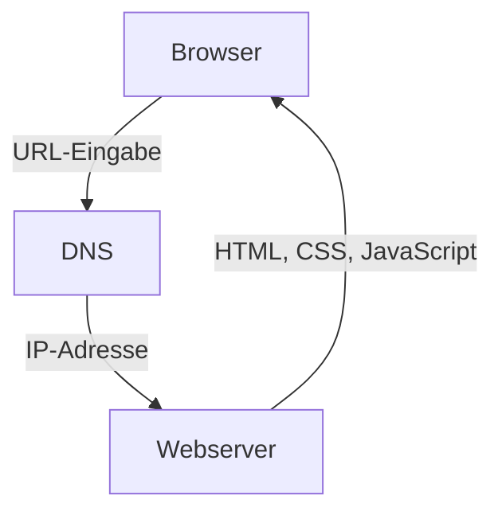
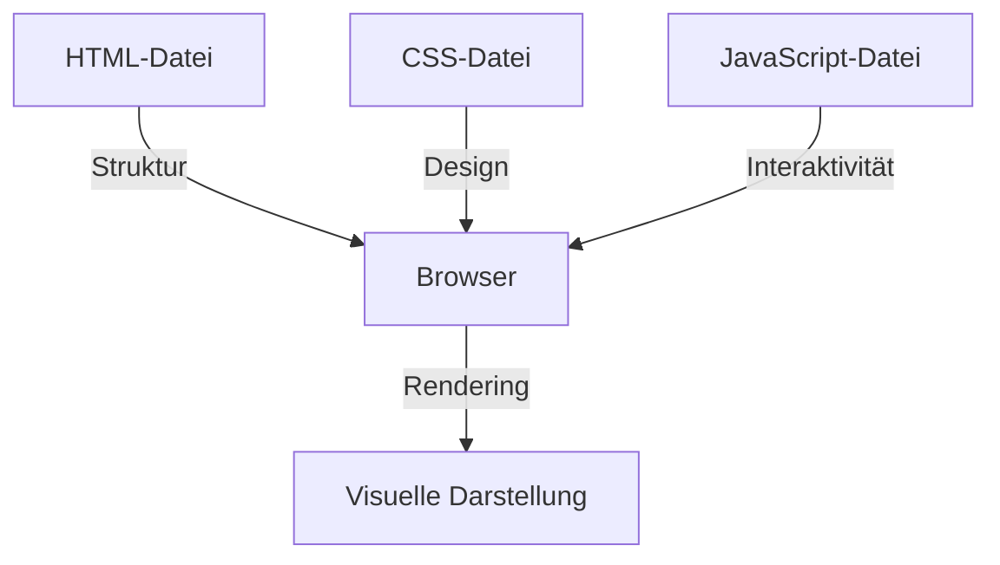

## Die Zutaten für eine Website

Für eine Website braucht es drei grundlegende Technologien: HTML, CSS und JavaScript. Jede dieser Technologien hat eine spezifische Aufgabe. HTML ist für die Struktur der Website zuständig, CSS für das Aussehen und JavaScript für die Interaktion.

Die Dateien, die du dabei erstellst, sind nichts weiter als reine Textdateien, die du mit jedem Texteditor bearbeiten kannst. Diese `.html`-, `.css`- und `.js`-Dateien werden durch einen sogenannten „Webserver“[^1] an den Browser bereitgestellt. Dieser interpretiert diese Dateien und wandelt die Inhalte durch den Prozess des „Renderns“ in eine visuelle Darstellung um.

Um das genauer zu verstehen, schauen wir uns die einzelnen Schritte an.

> Auf der Seite [Grundlagen](/grundlagen) erkläre ich dir genauer, was HTML, CSS und JavaScript ist. In den Tutorials zu [HTML](/tutorials/einstieg-in-html) und [CSS](/tutorials/einstieg-in-css) lernst die Grundlagen kennen. Und im Tutorial [So erstellt du eine Website](/tutorials/website-mit-visual-studio-code) erfährst du, wie du mit Visual Studio Code eine Website erstellen kannst.

## Bereitstellung für den Browser

Betrachten wir zuerst den Prozess, wie die Dateien der Website in den Browser gelangen. Wenn du eine Website aufrufst, geschieht Folgendes:

1. Durch die Eingabe einer URL wie `hawk-gt1191.de` stellt der Browser eine Anfrage an einen Domain-Name-Server (DNS). Das ist eine Art von Adressverzeichnis, das die URL in eine IP-Adresse übersetzt. Die IP-Adresse `192.168.1.1` zum Beispiel ist sozusagen die Adresse des Servers in deinem Netzwerk oder im Internet.
2. Der Browser sendet eine HTTP-Anfrage[^2] an den Webserver mit der IP-Adresse. Diese Anfrage enthält Informationen darüber, welche Dateien benötigt werden. Das ist die HTML-Datei, sowie die in ihr referenzierten CSS- und JavaScript-Dateien.
3. Der Webserver empfängt die Anfrage und sendet die angeforderten Dateien zurück an den Browser.

Im Flussdiagramm siehst du, wie dieser Prozess abläuft:

## Interpretation und Rendering

Da der Browser nun alle benötigten Dateien hat, beginnt er mit der Interpretation der Dateien. Zur Erinnerung: Die Dateien sind reine Textdateien, die der Browser zunächst lesen und verstehen, sprich interpretieren muss. Das geschieht in mehreren Schritten:

1. **HTML-Parsing**: Der Browser liest die HTML-Datei und erstellt ein sogenanntes „Document Object Model“ (DOM). Das ist eine Art Baumstruktur, die die Hierarchie der HTML-Elemente darstellt.
2. **CSS-Parsing**: Der Browser liest die CSS-Datei und erstellt ein „CSS Object Model“ (CSSOM). Das ist eine ähnliche Baumstruktur, die die Stile der HTML-Elemente beschreibt.
3. **JavaScript-Parsing**: Der Browser liest die JavaScript-Datei und führt den Code aus. Dabei kann der JavaScript-Code auf das DOM und das CSSOM zugreifen, um die Struktur und das Aussehen der Website zu ändern.
4. **Rendering**: Der Browser kombiniert das DOM und das CSSOM, um den sogenannten „Render-Tree“ zu erstellen. Dieser Baum enthält nur die sichtbaren Elemente der Website und deren Stile. Anschließend wird der Render-Tree in Pixel umgewandelt und auf dem Bildschirm dargestellt.
5. **Layout**: Der Browser berechnet die Position und Größe jedes Elements auf dem Bildschirm. Das geschieht in mehreren Schritten, die als „Reflow“ bezeichnet werden.
6. **Painting**: Der Browser malt die einzelnen Elemente auf den Bildschirm. Das geschieht in mehreren Schritten, die als „Rasterisierung“ bezeichnet werden.
7. **Komposition**: Der Browser kombiniert die einzelnen Schichten der Website zu einem einzigen Bild, das auf dem Bildschirm angezeigt wird.

Vereinfacht gesagt interpretiert der Browser die HTML-, CSS- und JavaScript-Dateien, um eine visuelle Darstellung der Website zu erstellen. Im Flowchart sieht das so aus:

Da du das Prinzip nun nachvollziehen kannst, erstelle doch jetzt einmal eine HTML-Seite wie im Tutorial [So erstellst du eine Website](/tutorials/website-mit-visual-studio-code) beschrieben. Du kannst die HTML-Seite in Visual Studio Code erstellen und sie dann im Browser öffnen. Wenn du die Seite öffnest, siehst du, wie der Browser die HTML-Datei interpretiert und die Website anzeigt.

Zum lernen von HTML und CSS empfehle ich dir die [Lernpfade](/tutorials/lernpfade/einfuehrung), bei denen ich die Schritt für Schritt erkläre, wie du eine Website erstellst. Du kannst auch die [Tutorials](/tutorials) durchstöbern, um mehr über HTML, CSS und JavaScript zu erfahren.

[^1]: Ein Webserver ist ein Computer, der Webseiten speichert und sie über das Internet bereitstellt. Beispiele für Webserver-Software sind Apache und nginx. Diese Programme empfangen Anfragen von Browsern, verarbeiten sie und senden die angeforderten Dateien (HTML, CSS, JavaScript) zurück. Du kannst über sogenannte Provider eine Domain beantragen und Speicherplatz mieten, um deine Website zu hosten. Das Hosting meint nichts anderes, als dass deine Website auf einem Server gespeichert ist und über das Internet erreichbar ist. Das Hosting kann auch lokal auf deinem Computer erfolgen, wenn du einen lokalen Webserver verwendest.
[^2]: HTTP steht für Hypertext Transfer Protocol. Es ist ein Protokoll, das den Austausch von Daten zwischen dem Browser und dem Webserver regelt. Deshalb steht vor einer URL auch `http://` oder `https://`.